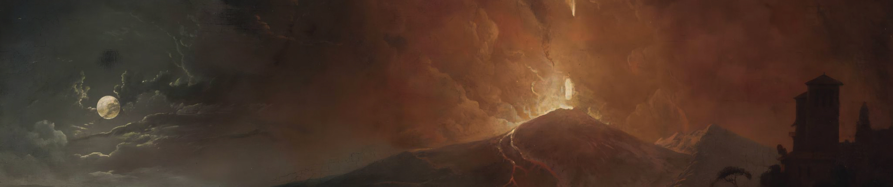

# Vesuvius Challenge - Ink Detection
## Top solution

閾値を動的に決定（https://www.kaggle.com/competitions/vesuvius-challenge-ink-detection/discussion/417274）

2.5次元のアプローチは、モデルはどの層にインクが含まれているかを学習しているため最適でない

3DConvは遅いが精度が良い

Label smoosing

Cutmix

テストデータの特性を分析し（LB probing）精度向上策を考える

Normalization（https://www.kaggle.com/competitions/vesuvius-challenge-ink-detection/discussion/417255）

Stochastic Weight Averaging

## Reflection

### Code

訓練コードと推論コードでCFGを使いまわせるようにする

最終的にアンサンブルまですることを考えると、全体CFG・データセットCFG・モデルCFGに分けると良い

訓練・推論時間を短縮する方法は早めに考えて実装

推論コードにデバッグモードを作る

### Data

テストデータがどんなものかについての洞察を得るようにする

推論に使うデータはすべて一か所にまとめる。一部のデータだけがinputフォルダ内にあるようにはしない

### Experiments

augmentationをもっと色々試行し、有効なものを検証

筋の悪い仮説はすぐに捨て、試行錯誤の種類と回数を増やす

CVスコアだけでなく、LBスコアの確認まで含めて一つの検証。最初のうちからsubmitすればよかった

最終modelは30分もあれば推論が終了した。もっと推論に時間がかかるものも試せばよかった

最後に閾値調整をするなら、training時に性能を図る際の閾値を0.5に固定するのではなく、複数の閾値の中で一番良い成績のものをそのモデルの性能とすればよかった

## Not working well

Fragment flattening（https://www.kaggle.com/code/henrikbrk/fragment-flattening）

Clipping

Large img size

CLAHE

High/Low pass filter

## Solution

Layer augmentation

label、maskの一部をtopographic_map（https://www.kaggle.com/code/henrikbrk/fragment-flattening）をもとに削除

Model: Proposed in https://www.kaggle.com/code/hengck23/lb0-68-one-fold-stacked-unet

Loss: BCE

Morphological processing